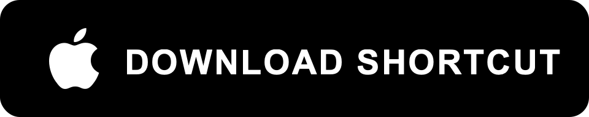

# 📊 Amazon Price Peek

Check any Amazon product's price history with a single tap. No app install. No subscription. Just a Shortcut.

A native Apple Shortcut that shows you the full price history of any Amazon product — powered by [CamelCamelCamel](https://camelcamelcamel.com). Share a product from the Amazon app, and the price chart loads instantly in an in-app browser.

---

## ⬇ Installation

**Requirements:** iOS 15 or later · Shortcuts app (pre-installed on iOS)

1. Tap the download button above on your iPhone.
2. Shortcuts app opens with a preview — tap **Add Shortcut**.

That's it. The shortcut now lives in your library.

---

## 🚀 Quick Start

1. Open the **Amazon** app on your iPhone.
2. Navigate to any product page.
3. Tap the **Share** button (arrow icon).
4. Tap **More** if needed, then select **Amazon Price History**.
5. First time: iOS asks permission to load web content — tap **Allow**.
6. The price history page loads in an in-app browser overlay.
7. Scroll down slightly to see the chart.
8. Tap **Done** to return to the Amazon app.

---

## 💡 Why?

Browser extensions like The Camelizer work great on desktop — but they don't exist on iPhone. The Amazon app gives you no price history at all. You're left guessing whether $14.99 is a deal or a markup.

This shortcut fixes that in one tap. No account, no tracking, no ads. It runs entirely on-device and just opens a web page. Your browsing stays private.

Paid apps on the App Store charge monthly for the same thing. This is free, open source, and takes 10 seconds to install.

---

## ✨ Features

- Works with Amazon short links (`a.co/...`) and full Amazon URLs
- Full interactive price chart — 1 Month, 3 Months, 6 Months, 1 Year, All
- Shows lowest, highest, current, and average prices
- Covers Amazon direct, 3rd Party New, and 3rd Party Used
- In-app browser overlay — no app switching, tap Done to go back
- No API keys, no accounts, no subscriptions
- Works on iPhone and iPad

---

## 🛠 How It Works

The shortcut is 4 actions:

| # | Action | What it does |
|---|--------|-------------|
| 1 | **Text** | Converts the shared URL to a plain string |
| 2 | **URL Encode** | Percent-encodes the URL for use as a query parameter |
| 3 | **Text** | Builds the search URL: `camelcamelcamel.com/search?sq=<encoded URL>` |
| 4 | **Show Web Page** | Opens the result in an in-app browser overlay |

CamelCamelCamel handles the redirect resolution and product lookup on their end. No ASIN extraction needed on-device.

---

## ❓ FAQ

<strong>Does this need internet?</strong>

Yes. The price history data comes from CamelCamelCamel's website, which requires a network connection.

<strong>Is my data safe?</strong>

The shortcut sends only the Amazon product URL to CamelCamelCamel (a well-known, trusted price tracking service). No personal data is collected or transmitted. Everything runs locally on your device.

<strong>I see a Cloudflare verification page instead of the chart.</strong>

CamelCamelCamel uses Cloudflare for bot protection. Solve the checkbox once and it remembers you for a while. This is rare on normal usage.

<strong>Does it work outside the US?</strong>

CamelCamelCamel supports multiple Amazon locales (UK, DE, CA, etc.). The search should resolve most international Amazon URLs, but chart data availability varies by region.

---

## 🤝 Contributing

- Bug or idea → [open an Issue](https://github.com/caliboycoder/Amazon-Product-Price-Peek/issues)
- Pull requests welcome

If you fork this project or use it as a base for your own shortcut, please give credit by linking back to this repository.

---

## ⭐ Support

If you find this useful, give the repo a star — it helps others discover it.

---

## 📄 License

[MIT](LICENSE)

---

## 🙏 Credits

Made by [caliboycoder](https://github.com/caliboycoder)

Price data provided by [CamelCamelCamel](https://camelcamelcamel.com).
